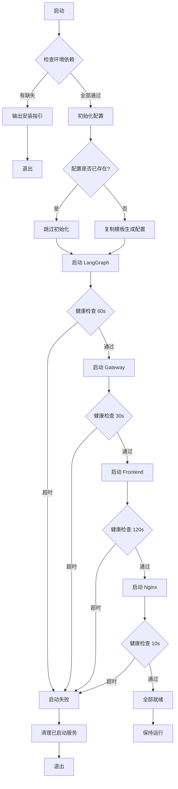

# DeerFlow Desktop Launcher - 启动逻辑 Demo 开发规范

**版本**: v0.2.0-demo\
**日期**: 2026-03-30\
**目标**: 实现基础启动逻辑 Demo，验证技术方案可行性

***

## 📋 Demo 目标

实现一个最小可用版本（MVP），能够：

1. **检测环境依赖**（Python/Node/uv/pnpm/nginx）
2. **初始化配置文件**（首次启动时从模板生成）
3. **按序启动 4 个服务**（LangGraph → Gateway → Frontend → Nginx）
4. **监控服务健康状态**（端口轮询）
5. **提供基础日志输出**

**非目标**（暂不实现）：

- GUI 界面（使用控制台输出即可）
- 配置编辑功能
- 资源监控图表
- Skill/MCP 管理
- 打包发布

***

## 🏗️ 模块划分

### 1. EnvChecker（环境检测器）

**职责**: 检查 DeerFlow 运行所需的全部依赖是否已安装且版本符合要求

**检查项**：

| 依赖      | 最低版本  | 检查命令               | 错误处理             |
| ------- | ----- | ------------------ | ---------------- |
| Python  | 3.12+ | `python --version` | 提示安装 Python 3.12 |
| Node.js | 22+   | `node --version`   | 提示安装 Node.js 22  |
| uv      | any   | `uv --version`     | 提示安装 uv          |
| pnpm    | any   | `pnpm --version`   | 提示安装 pnpm        |
| Nginx   | any   | `nginx -v`         | 提示安装 Nginx       |

**输出**: `EnvCheckResult` 对象，包含 `success` 标志和 `missing` 数组

***

### 2. ConfigInitializer（配置初始化器）

**职责**: 复制模板文件生成配置文件（严格幂等，绝不覆盖现有配置）

**处理文件**：

- `config.yaml` ← `config.example.yaml`
- `.env` ← `.env.example`
- `frontend/.env` ← `frontend/.env.example`
- `extensions_config.json` ← `extensions_config.json.example`

**幂等策略**：

1. 遍历上述文件列表
2. 检查目标文件是否存在
3. 若存在 → 跳过，记录日志 "config.yaml already exists, skipping"
4. 若不存在 → 复制模板，记录日志 "Created config.yaml from template"

**输出**: `ConfigInitResult` 对象，包含 `created` 和 `skipped` 数组

***

### 3. ProcessManager（进程管理器）

**职责**: 使用 PM2 Programmatic API 管理服务生命周期

**服务定义**：

```typescript
interface ServiceDefinition {
  name: string;           // 服务标识：langgraph / gateway / frontend / nginx
  script: string;         // 启动脚本路径
  args?: string[];        // 启动参数
  cwd: string;            // 工作目录
  port: number;           // 健康检查端口
  timeout: number;        // 启动超时（毫秒）
  dependencies?: string[]; // 前置依赖服务
  env?: Record<string, string>; // 环境变量
}
```

**启动顺序**：

```
langgraph (port 2024, timeout 60s)
  ↓ 等待 healthy
gateway (port 8001, timeout 30s)
  ↓ 等待 healthy
frontend (port 3000, timeout 120s)
  ↓ 等待 healthy
nginx (port 2026, timeout 10s)
```

**健康检查策略**：

1. 服务启动后，每 1 秒轮询对应端口
2. 端口可连接 → 标记为 healthy
3. 超时前未就绪 → 标记为 failed，终止后续启动

**PM2 配置选项**：

```javascript
{
  exec_mode: 'fork',        // 单进程模式（开发阶段）
  instances: 1,
  autorestart: false,       // Demo 阶段不自动重启
  max_restarts: 0,
  min_uptime: '10s',
  log_file: './logs/{name}.log',
  out_file: './logs/{name}-out.log',
  error_file: './logs/{name}-error.log',
  merge_logs: false,
  time: true                // 日志带时间戳
}
```

***

### 4. HealthChecker（健康检查器）

**职责**: 检测服务端口是否可连接

**实现方式**：

- Node.js `net.createConnection()` 尝试连接目标端口
- 连接成功 → 立即断开，返回 healthy
- 连接失败 → 等待 1 秒后重试
- 超过 timeout → 返回 timeout 错误

**接口定义**：

```typescript
interface HealthCheckOptions {
  host: string;      // 默认 localhost
  port: number;
  timeout: number;   // 总超时时间
  interval: number;  // 轮询间隔（默认 1000ms）
}

interface HealthCheckResult {
  status: 'healthy' | 'timeout' | 'error';
  port: number;
  duration: number;  // 实际耗时
  error?: string;
}
```

***

### 5. Logger（日志管理器）

**职责**: 统一日志输出，支持控制台和文件写入

**日志级别**：

- `DEBUG` - 调试信息（开发阶段开启）
- `INFO` - 常规操作记录
- `WARN` - 警告信息
- `ERROR` - 错误信息

**输出格式**：

```
[2026-03-30 14:32:15] [INFO] [ProcessManager] Gateway service started successfully
[2026-03-30 14:32:16] [ERROR] [HealthChecker] Frontend health check failed: Connection refused
```

**日志文件**：

- 控制台：彩色输出（使用 chalk）
- 文件：`logs/launcher-{date}.log`

***

## 📐 数据类型定义

### 核心枚举

```typescript
// 服务名称枚举
enum ServiceName {
  LANGGRAPH = 'langgraph',
  GATEWAY = 'gateway',
  FRONTEND = 'frontend',
  NGINX = 'nginx'
}

// 服务状态枚举
enum ServiceStatus {
  PENDING = 'pending',       // 等待启动
  STARTING = 'starting',     // 启动中
  HEALTHY = 'healthy',       // 健康运行
  FAILED = 'failed',         // 启动失败
  STOPPED = 'stopped'        // 已停止
}

// 整体启动状态
enum LaunchStatus {
  IDLE = 'idle',
  CHECKING_ENV = 'checking_env',
  INIT_CONFIG = 'init_config',
  STARTING_SERVICES = 'starting_services',
  READY = 'ready',
  FAILED = 'failed',
  SHUTTING_DOWN = 'shutting_down'
}
```

### 核心接口

```typescript
// 服务实例状态
interface ServiceInstance {
  name: ServiceName;
  status: ServiceStatus;
  pid?: number;              // PM2 进程 ID
  port: number;
  startTime?: Date;
  healthCheckDuration?: number;
  error?: string;
}

// 启动上下文
interface LaunchContext {
  status: LaunchStatus;
  services: Map<ServiceName, ServiceInstance>;
  deerflowPath: string;      // DeerFlow 仓库根目录
  logDir: string;
  startTime: Date;
}

// 启动结果
interface LaunchResult {
  success: boolean;
  status: LaunchStatus;
  services: ServiceInstance[];
  totalDuration: number;
  error?: string;
}

// 环境检查结果
interface EnvCheckResult {
  success: boolean;
  python?: { version: string; path: string };
  node?: { version: string; path: string };
  uv?: { version: string; path: string };
  pnpm?: { version: string; path: string };
  nginx?: { version: string; path: string };
  missing: string[];
  errors: string[];
}

// 配置初始化结果
interface ConfigInitResult {
  success: boolean;
  created: string[];   // 成功创建的文件列表
  skipped: string[];   // 已存在而跳过的文件列表
  failed: string[];    // 创建失败的文件列表
}
```

***

## 🔄 核心流程设计

### 主启动流程



### 服务启动详细流程

```typescript
// 伪代码描述
async function startService(service: ServiceDefinition): Promise<ServiceInstance> {
  // 1. 检查依赖服务是否就绪
  for (const dep of service.dependencies) {
    const depService = context.services.get(dep);
    if (depService?.status !== ServiceStatus.HEALTHY) {
      throw new Error(`Dependency ${dep} is not ready`);
    }
  }

  // 2. 使用 PM2 启动进程
  const proc = await pm2.start({
    name: service.name,
    script: service.script,
    args: service.args,
    cwd: service.cwd,
    // ... 其他 PM2 配置
  });

  // 3. 更新状态为 STARTING
  instance.status = ServiceStatus.STARTING;
  instance.pid = proc.pid;
  instance.startTime = new Date();

  // 4. 执行健康检查
  const healthResult = await healthChecker.check({
    port: service.port,
    timeout: service.timeout
  });

  // 5. 根据结果更新状态
  if (healthResult.status === 'healthy') {
    instance.status = ServiceStatus.HEALTHY;
    instance.healthCheckDuration = healthResult.duration;
    logger.info(`${service.name} is ready`);
  } else {
    instance.status = ServiceStatus.FAILED;
    instance.error = healthResult.error;
    throw new Error(`${service.name} failed to start: ${healthResult.error}`);
  }

  return instance;
}
```

***

## 🛡️ 错误处理规范

### 错误分类

| 错误类型  | 示例         | 处理策略                |
| ----- | ---------- | ------------------- |
| 环境错误  | Python 未安装 | 输出安装指引，优雅退出         |
| 配置错误  | 模板文件缺失     | 提示检查 DeerFlow 仓库完整性 |
| 启动错误  | 端口被占用      | 提示释放端口或检查已运行实例      |
| 超时错误  | 服务启动超时     | 终止流程，输出失败服务日志       |
| 运行时错误 | 服务崩溃       | Demo 阶段直接退出，不自动重启   |

### 错误数据结构

```typescript
interface LauncherError {
  code: string;           // 错误码，如 ENV_PYTHON_MISSING
  message: string;        // 用户友好错误信息
  details?: string;       // 技术细节
  service?: ServiceName;  // 关联服务
  suggestion?: string;    // 修复建议
}

// 错误码定义
const ErrorCodes = {
  // 环境错误 (ENV_*)
  ENV_PYTHON_MISSING: 'ENV_PYTHON_MISSING',
  ENV_PYTHON_VERSION: 'ENV_PYTHON_VERSION',
  ENV_NODE_MISSING: 'ENV_NODE_MISSING',
  ENV_NODE_VERSION: 'ENV_NODE_VERSION',
  ENV_UV_MISSING: 'ENV_UV_MISSING',
  ENV_PNPM_MISSING: 'ENV_PNPM_MISSING',
  ENV_NGINX_MISSING: 'ENV_NGINX_MISSING',
  
  // 配置错误 (CFG_*)
  CFG_TEMPLATE_MISSING: 'CFG_TEMPLATE_MISSING',
  CFG_CREATE_FAILED: 'CFG_CREATE_FAILED',
  CFG_INVALID_PATH: 'CFG_INVALID_PATH',
  
  // 启动错误 (START_*)
  START_DEPENDENCY_FAILED: 'START_DEPENDENCY_FAILED',
  START_PORT_TIMEOUT: 'START_PORT_TIMEOUT',
  START_PM2_ERROR: 'START_PM2_ERROR',
  START_PROCESS_CRASH: 'START_PROCESS_CRASH',
  
  // 运行时错误 (RUNTIME_*)
  RUNTIME_PM2_DISCONNECT: 'RUNTIME_PM2_DISCONNECT',
  RUNTIME_UNEXPECTED_EXIT: 'RUNTIME_UNEXPECTED_EXIT'
} as const;
```

### 清理策略

当启动流程失败时，必须执行清理：

1. 停止所有已启动的 PM2 进程
2. 断开 PM2 连接
3. 释放资源
4. 输出诊断信息（各服务日志路径）

```typescript
async function cleanup(context: LaunchContext): Promise<void> {
  logger.info('Starting cleanup...');
  
  for (const [name, service] of context.services) {
    if (service.status === ServiceStatus.HEALTHY || 
        service.status === ServiceStatus.STARTING) {
      try {
        await pm2.stop(name);
        await pm2.delete(name);
        logger.info(`Stopped ${name}`);
      } catch (err) {
        logger.error(`Failed to stop ${name}: ${err}`);
      }
    }
  }
  
  await pm2.disconnect();
  logger.info('Cleanup completed');
}
```

***

## 📊 日志规范

### 日志级别使用场景

| 级别    | 使用场景   | 示例                                           |
| ----- | ------ | -------------------------------------------- |
| DEBUG | 详细流程追踪 | "Checking Python at C:\Python312\python.exe" |
| INFO  | 关键状态变更 | "LangGraph service is starting"              |
| WARN  | 非致命异常  | "config.yaml already exists, skipping"       |
| ERROR | 致命错误   | "Gateway failed to start: port timeout"      |

### 各模块日志前缀

```
[EnvChecker]   - 环境检测相关
[ConfigInit]   - 配置初始化相关
[ProcessMgr]   - 进程管理相关
[HealthCheck]  - 健康检查相关
[Launcher]     - 主流程相关
```

***

## 🧪 测试策略

### 单元测试范围

| 模块            | 测试内容         | 模拟策略             |
| ------------- | ------------ | ---------------- |
| EnvChecker    | 各依赖检测逻辑      | 模拟 `which` 命令返回  |
| ConfigInit    | 文件存在性判断、复制逻辑 | 使用内存文件系统         |
| HealthChecker | 端口轮询逻辑、超时处理  | 创建临时 TCP 服务器     |
| Logger        | 格式化输出、级别过滤   | 捕获 stdout/stderr |

### 集成测试场景

1. **首次启动流程**
   - 清理所有配置文件
   - 执行启动
   - 验证配置生成 + 服务启动
2. **重复启动流程**
   - 保持已有配置
   - 执行启动
   - 验证配置跳过 + 服务启动
3. **失败清理测试**
   - 模拟中间服务启动失败
   - 验证已启动服务被正确停止
4. **端口占用测试**
   - 预占用某个服务端口
   - 验证超时错误和清理行为

***

## 📁 Demo 项目结构

```
./launcher/demo/
├── src/
│   ├── main.ts                 # 入口文件
│   ├── types/
│   │   └── index.ts            # 类型定义
│   ├── core/
│   │   ├── Launcher.ts         # 主启动器
│   │   └── LaunchContext.ts    # 上下文管理
│   ├── modules/
│   │   ├── EnvChecker.ts       # 环境检测器
│   │   ├── ConfigInitializer.ts # 配置初始化器
│   │   ├── ProcessManager.ts   # 进程管理器
│   │   ├── HealthChecker.ts    # 健康检查器
│   │   └── Logger.ts           # 日志管理器
│   ├── config/
│   │   └── services.ts         # 服务定义配置
│   └── utils/
│       └── errors.ts           # 错误处理工具
├── logs/                       # 日志输出目录
├── tests/
│   ├── unit/
│   └── integration/
├── package.json
├── tsconfig.json
└── README.md                   # Demo 使用说明
```

***

## 🚀 快速开始指南

### 环境要求

- Node.js 18+
- DeerFlow 仓库已克隆到本地

### 安装依赖

```bash
npm install
# 或
pnpm install
```

### 运行 Demo

```bash
# 设置 DeerFlow 路径（必须）
export DEERFLOW_PATH=/path/to/deer-flow

# 运行启动器
npm start
```

### 预期输出

```
[14:32:10] [INFO] [Launcher] DeerFlow Launcher Demo v0.1.0
[14:32:10] [INFO] [EnvChecker] Checking environment dependencies...
[14:32:11] [INFO] [EnvChecker] ✓ Python 3.12.1
[14:32:11] [INFO] [EnvChecker] ✓ Node.js 22.5.0
[14:32:11] [INFO] [EnvChecker] ✓ uv 0.5.0
[14:32:11] [INFO] [EnvChecker] ✓ pnpm 10.26.2
[14:32:11] [INFO] [EnvChecker] ✓ nginx 1.26.0
[14:32:11] [INFO] [ConfigInit] Initializing configurations...
[14:32:11] [WARN] [ConfigInit] config.yaml already exists, skipping
[14:32:11] [INFO] [ConfigInit] Created .env from template
[14:32:11] [INFO] [ProcessMgr] Starting LangGraph service...
[14:32:15] [INFO] [HealthCheck] LangGraph is healthy (port 2024, 4321ms)
[14:32:15] [INFO] [ProcessMgr] Starting Gateway service...
[14:32:18] [INFO] [HealthCheck] Gateway is healthy (port 8001, 2890ms)
[14:32:18] [INFO] [ProcessMgr] Starting Frontend service...
[14:32:35] [INFO] [HealthCheck] Frontend is healthy (port 3000, 16543ms)
[14:32:35] [INFO] [ProcessMgr] Starting Nginx service...
[14:32:36] [INFO] [HealthCheck] Nginx is healthy (port 2026, 890ms)
[14:32:36] [INFO] [Launcher] All services are ready! (total: 26.5s)
[14:32:36] [INFO] [Launcher] Access DeerFlow at http://localhost:2026
```

***

## 📝 开发 Checklist

### Phase 1: 基础框架

- [ ] 初始化 TypeScript Node.js 项目
- [ ] 配置 ESLint + Prettier
- [ ] 安装依赖（pm2, chalk, 等）
- [ ] 编写类型定义文件

### Phase 2: 核心模块

- [ ] 实现 Logger 模块
- [ ] 实现 EnvChecker 模块
- [ ] 实现 ConfigInitializer 模块
- [ ] 实现 HealthChecker 模块
- [ ] 实现 ProcessManager 模块

### Phase 3: 流程整合

- [ ] 实现 Launcher 主类
- [ ] 实现启动流程编排
- [ ] 实现错误处理和清理逻辑
- [ ] 编写入口文件 (main.ts)

### Phase 4: 测试验证

- [ ] 编写单元测试
- [ ] 执行集成测试
- [ ] 验证错误场景处理
- [ ] 编写使用文档

***

## 🔮 后续扩展方向

Demo 验证通过后，可基于本规范扩展：

1. **GUI 界面** - 使用 Electron + React 构建图形界面
2. **配置编辑器** - 可视化编辑 config.yaml 和 .env
3. **实时日志** - WebSocket 推送日志到前端
4. **资源监控** - 集成 systeminformation 展示系统资源
5. **进程守护** - 启用 PM2 autorestart 实现故障自愈

